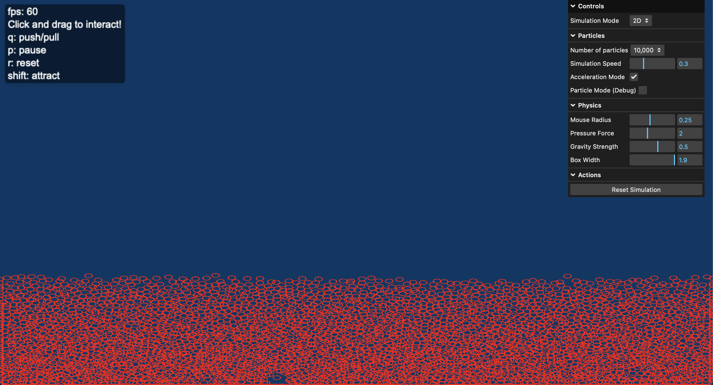

# Fluid Simulation

A real-time WebGPU-based particle fluid simulation with interactive controls.



## Features

- Both 2D and 3D visualization modes
- Marching Cubes algorithm for realistic fluid surface rendering
- Real-time parameter adjustment through GUI controls
- Mouse interaction to manipulate fluid
- High-performance computation using WebGPU

## Installation

1. Clone the repository:

```sh
git clone https://github.com/RamonAsuncion/fluid-simulation.git
cd fluid-simulation
```

2. Run the local web server

```sh
python simple_server.py
```

3. Open your WebGPU-compatible browser (Chrome 113+ or Edge 113+) and navigate to:

```sh
http://localhost:8000
```

## Usage

Controls

- Click + Mouse Drag: Move particles in the simulation (2D mode only)
- Shift + Mouse: Attract particles (2D mode only)
- P: Pause/resume simulation
- R: Reset simulation
- Click + Mouse Drag: Rotate camera (3D mode only)

GUI Controls

- Simulation mode 2D vs 3D
- Number of particles
- Simulation speed
- Acceleration mode (used to speed up the rendering)

## Technical Details

The simulation implements [Smoothed-particle hydrodynamics (SPH)](https://en.wikipedia.org/wiki/Smoothed-particle_hydrodynamics) for fluid dynamics simulation.

Key technical components:

- Spatial partitioning grid for efficient neighbor searching
- Pressure and viscosity approximation
- Marching cubes algorithm for surface extraction
- WebGPU compute shaders for processing particle physics

## Reflecions

**Luke Synder:** For this project I mainly focused on the physics aspect of the simulation. My main inspiration was Sebastion League's video on fluid simulations. This was a very difficult project, with a lot having to be made before being able to see any results. While we didn't quite simulate water, I am still super proud of how the simulation looks and performs. The main changes that would improve the simulation would be how the particles interact with the edge of the box, and how the particles tend to climb together. I really enjoyed this project and learned a lot about webGPU and physics simulation.

**Ramon Asuncion**: I focused on the user interaction and visual aspects of this project. The most challenging part was managing mouse interactions in the 3D space, as I considered using ray marching techniques. The idea was to create a ray from the camera to the mouse and then ray march until a particle was found. However, `applyMouseForce` function affects a large, specific section of the bounding box, so even a slight mouse movement changes a significant portion of the particles. Overall, though, the project was both fun and challenging, I wouldn’t have chosen any other.

**Nolan Sauers**: I was the primary developer for the surface logic (using the famous marching cubes algorithm) to make a version of our simulation that looked and "flowed" like a realistic liquid. I got close many different times, but even after five or six different implementations it still wasn't perfect. As you can probably see, my biggest challenge was not the marching cubes algorithm itself but using it to render a realistic liquid movement based on our particles. Still, I was able to render a set of horizontal planes, a large sphere, and some honey-like substance with relative accuracy. Though it was frustrating at times, the final product is something I'm proud of enough to show anyone that wants to take a peek.

## Contributors

- Ramon Asuncion - UI interactions
- Nolan Sauers - Ray Marching
- Luke Snyder - Physics

## License

Distributed under the Creative Commons Attribution-NonCommerical 4.0 International License. See LICENSE.txt for more information.
